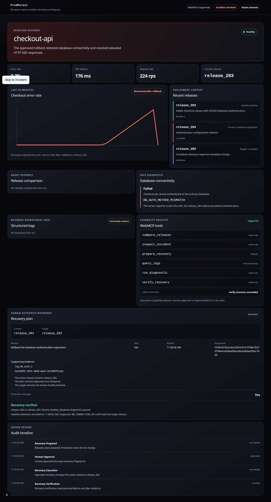

# Recovery Control Room

Recovery Control Room is a browser-native incident workspace for human-approved production recovery. An AI agent investigates a deterministic checkout failure through WebMCP tools, prepares one exact rollback, and receives execution capability only after a person approves the displayed plan.

## Try the live application

- Application: https://recovery-control-room.vercel.app
- Primary API health through Vercel: https://recovery-control-room.vercel.app/api/backend/health
- Fallback API health: https://ankan-linux.tailf04855.ts.net/api/health

The backend runs on an always-on Linux machine. If the machine is offline, the live demo cannot create or load sessions.

## Why WebMCP

Incident response mixes machine-readable evidence with decisions that require human authority. Recovery Control Room gives an agent structured investigation tools instead of asking it to infer state from page text. The browser adds the execution tool only after a person approves the exact recovery fingerprint, and removes the tool after execution or revocation.

The initial registry contains:

- `inspect_incident`
- `compare_releases`
- `query_logs`
- `run_diagnostic`
- `prepare_recovery`
- `verify_recovery`

The conditional `execute_approved_recovery` tool accepts only the approved plan ID.

## Run locally

Install Rust, Bun 1.3.14 or later, Node.js 24, and a Chromium browser.

~~~bash
bun install --frozen-lockfile
docker compose up --build
~~~

Open http://localhost:3000. The frontend sends `/api/backend/*` requests through a same-origin Next.js rewrite to the Rust API.

To run the services without Docker:

~~~bash
bun run dev
~~~

## Verify the project

Run the Rust checks:

~~~bash
cargo fmt --all -- --check
cargo clippy --workspace --all-targets --all-features -- -D warnings
cargo test --workspace --all-targets --all-features
~~~

Run the web checks:

~~~bash
bun install --frozen-lockfile
bun run typecheck
bun run lint
bun run test:web
bun run build:web
bun run test:e2e
~~~

The browser tests inject the current `document.modelContext` contract and call the registered tool callbacks. For a native check, use Chrome 149 or later, enable `chrome://flags/#enable-webmcp-testing`, restart Chrome, and open the application.

## Architecture

- Next.js 16 and React 19 render the operational workspace on Vercel.
- Rust and Axum own domain rules, authorization, session state, and recovery transitions.
- SQLite stores isolated demo sessions, recovery evidence, and the audit timeline.
- Cloudflare Tunnel publishes the loopback-only Rust service over HTTPS. Tailscale Funnel remains a fallback.
- Secure cookies bind each browser to one demo session.

The Rust backend is the only authority for recovery eligibility and capability state. TypeScript validates wire data and registers browser tools, but it does not duplicate recovery rules.

See [docs/TECHNICAL_SPEC.md](docs/TECHNICAL_SPEC.md), [docs/THREAT_MODEL.md](docs/THREAT_MODEL.md), and [docs/DEPLOYMENT.md](docs/DEPLOYMENT.md) for the full design and operating instructions.

## License

This project uses the [MIT License](LICENSE).
