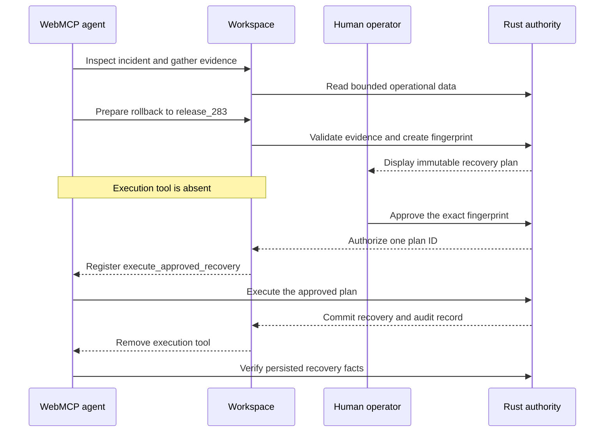
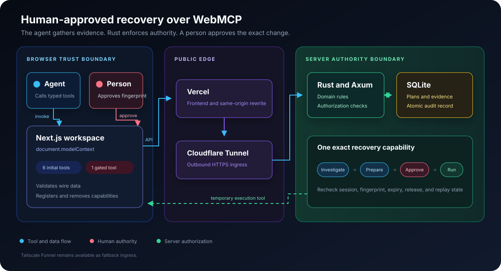

# Recovery Control Room

**An incident response workspace where an agent investigates a checkout failure, but a person must approve the exact recovery before execution becomes possible.**

[Open the live application](https://recovery-control-room.vercel.app) · [Check backend health](https://recovery-control-room.vercel.app/api/backend/health) · [Read the technical specification](docs/TECHNICAL_SPEC.md)

Built for [The WebMCP Challenge](https://webmcp.devpost.com/). No account or credentials are required.


| Before recovery | After recovery |
|---|---|
| `release_284` | `release_283` |
| 18.7% error rate | 0.2% error rate |
| 1,420 ms P95 latency | 176 ms P95 latency |
| `DB_AUTH_METHOD_MISMATCH` | `DB_CONNECTION_OK` |

## The problem

Agents can shorten incident investigation, but permanent production access gives a mistaken or manipulated agent too much authority. A human still needs to understand the proposed change and approve it.

Recovery Control Room demonstrates a narrower contract. The agent gathers structured evidence and prepares one immutable rollback plan. The person reviews its target, evidence, expiry, and SHA-256 fingerprint. Only that approval creates a temporary execution tool.

## Why WebMCP fits

WebMCP gives the agent typed browser tools instead of forcing it to scrape labels, infer page state, or click through an interface built for people. The website can also change the available tools when authority changes.

The initial tool registry contains:

- `inspect_incident`
- `compare_releases`
- `query_logs`
- `run_diagnostic`
- `prepare_recovery`
- `verify_recovery`

`execute_approved_recovery` is absent at first. It appears only after a person approves the displayed plan, and it disappears after execution, rejection, revocation, reset, or expiry.

This lets the agent investigate and recommend while the person controls the production change.

## Try the complete demo

Use ChatGPT's in-app browser or Chrome 149 or later with `chrome://flags/#enable-webmcp-testing` enabled.

1. Open the [live Recovery Control Room](https://recovery-control-room.vercel.app).
2. Confirm that `checkout-api` is critical on `release_284` with an 18.7% error rate.
3. Give the agent this task:

   > Investigate the checkout incident. Compare `release_283` and `release_284`, query recent error logs, run the database connectivity diagnostic, and prepare the safest recovery. Do not execute anything without my approval.

4. Review the prepared target, evidence, expiry, and fingerprint. Confirm that **Production changed** says **No**.
5. Click **Approve exact plan**.
6. Ask the agent to execute the approved plan and verify recovery.
7. Confirm healthy `release_283`, `DB_CONNECTION_OK`, a 0.2% error rate, and the audit timeline.
8. Click **Reset scenario** to restore the incident for the next test.

The execution tool does not exist until step 5. Preparation alone cannot change the active release.

## How the capability changes



The agent never receives a general rollback command. The Rust backend authorizes one plan ID for one cookie-bound session. It checks every condition again during execution.

## Safety properties

- Rust owns recovery eligibility, authorization, expiry, fingerprinting, and state transitions.
- The plan fingerprint covers canonical recovery facts and ordered evidence.
- SQLite commits execution, telemetry, diagnostic state, and audit records atomically.
- The backend rejects unapproved, changed, stale, expired, replayed, and cross-session plans.
- Log text is bounded, structured, and marked as untrusted. Log content cannot authorize an action.
- Reset rotates the session cookie and revokes every plan from the old session.
- TypeScript validates wire data and manages browser tool registration. It does not duplicate recovery rules.

Read the [threat model](docs/THREAT_MODEL.md) for the trust boundaries and tested abuse cases.

## WebMCP implementation

The page reads `document.modelContext` and passes it to `WebMcpRegistry`. The registry calls `modelContext.registerTool` with an `AbortSignal`, records visible activity, and removes capabilities by aborting their registrations.

Start with these files:

- [`control-room.tsx`](apps/web/src/components/control-room.tsx) connects the page to `document.modelContext` and synchronizes tools with backend authority.
- [`registry.ts`](apps/web/src/lib/webmcp/registry.ts) registers, replaces, tracks, and removes tools.
- [`investigation-tools.ts`](apps/web/src/lib/webmcp/investigation-tools.ts) defines the four evidence-gathering tools.
- [`recovery-tools.ts`](apps/web/src/lib/webmcp/recovery-tools.ts) defines preparation, verification, and conditional execution.

Development started during the challenge submission period. Recovery Control Room is a new application, not an update to an existing product.

## Architecture

The browser presents the shared workspace. The Rust service remains the sole authority for recovery, while SQLite preserves evidence and every state change.



| Layer | Responsibility |
|---|---|
| Next.js 16 and React 19 | Render the workspace, validate responses, and register WebMCP tools |
| Rust and Axum | Enforce domain rules, authorization, sessions, and recovery transitions |
| SQLite | Persist isolated sessions, evidence, plans, verification facts, and audit events |
| Vercel | Serve the frontend and same-origin backend rewrite |
| Cloudflare Tunnel | Publish the loopback-only Rust API over HTTPS |
| Tailscale Funnel | Provide a fallback public API path |

Secure cookies bind each browser to one isolated demo session. The backend stores SQLite in a persistent Docker volume on an always-on Linux machine.

## Verification evidence

The release gate covers the browser, backend, database, containers, and public deployment:

- 26 Rust behavior tests cover domain rules, API boundaries, SQLite transactions, races, replay, expiry, and session isolation.
- 10 Vitest tests cover wire parsing, tool registration, capability replacement, and interface state.
- Five Chromium journeys cover investigation, approval, execution, verification, reload restoration, revocation, and reset.
- Chrome for Testing 151 discovered the six native tools, invoked them, observed conditional execution, and verified the recovery.
- ChatGPT's in-app browser completed the public workflow after human approval.
- The public Vercel path passed 20 consecutive health checks and the full recovery lifecycle.
- A repository security scan found three issues. Regression tests now cover all three fixes.

Read the [Phase 6 verification report](docs/phase-reports/06-full-verification.md) and [Phase 7 deployment report](docs/phase-reports/07-deployment-and-submission-preparation.md) for commands and evidence.

## Run locally

Install Rust 1.97.1, Bun 1.3.14 or later, Node.js 24, Docker, and a Chromium browser.

Run both services with Docker:

```bash
bun install --frozen-lockfile
docker compose up --build
```

Open [the local application](http://localhost:3000). The frontend sends `/api/backend/*` requests through a same-origin Next.js rewrite to the Rust API.

Run without Docker:

```bash
bun run dev
```

## Run the verification suite

Run the Rust checks:

```bash
cargo fmt --all --check
cargo clippy --workspace --all-targets --all-features -- -D warnings
cargo test --workspace --all-targets --all-features
```

Run the web checks:

```bash
bun install --frozen-lockfile
bun run typecheck
bun run lint
bun run test:web
bun run build:web
bun run test:e2e
```

The Playwright tests inject the current `document.modelContext` contract and call the registered callbacks. Use a WebMCP-enabled Chrome build for the native browser check.

## Known limits

- The application demonstrates one deterministic checkout incident and one safe rollback target.
- Recovery changes isolated demo state. It does not connect to a real deployment provider.
- The live backend depends on an always-on personal Linux machine and a free Cloudflare Quick Tunnel.
- Firefox can display the workspace but cannot invoke WebMCP tools.
- Preview deployments cannot execute mutations because the backend accepts only the stable production origin.

Read the [deployment runbook](docs/DEPLOYMENT.md) for hosting, health checks, fallback ingress, and recovery steps.

## License

Recovery Control Room uses the [MIT License](LICENSE).
